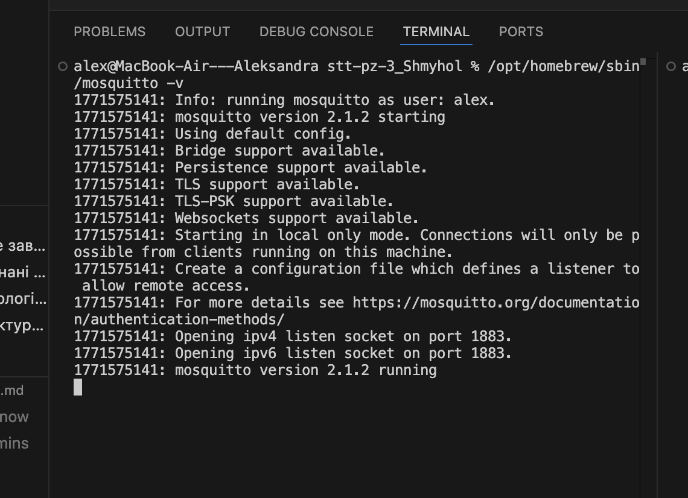

# Практичне завдання: Розгортання та налаштування MQTT-брокера (pz-MQTT)

Цей проєкт містить матеріали практичного заняття з розгортання MQTT-інфраструктури та тестування обміну повідомленнями за протоколом MQTT.

## 📋 Виконані завдання
- [x] Розгорнуто MQTT-брокер **Mosquitto** локально на macOS.
- [x] Налаштовано базову конфігурацію (дозвіл анонімних підключень).
- [x] Виконано публікацію та підписку на топіки через CLI (командний рядок).
- [x] Перевірено працездатність сервісу.

## 🛠 Технологічний стек
- **Broker:** Mosquitto (v2.1.2)
- **OS:** macOS (Apple Silicon)
- **Tools:** Homebrew, VS Code, MQTT CLI (mosquitto_pub/sub)

## 📂 Структура проєкту
```text
├── stt-pz-3
│   ├── broker
│   │   ├── mosquitto.conf      # Конфігурація брокера
│   │   ├── docker-compose.yml  # Варіант розгортання (резервний)
│   ├── screenshots             # Скріншоти підтвердження роботи
│   └── README.md               # Звіт про виконання

## Докази виконання

### 1. Статус брокера Mosquitto


### 2. Успішний обмін повідомленнями (Publish/Subscribe)
